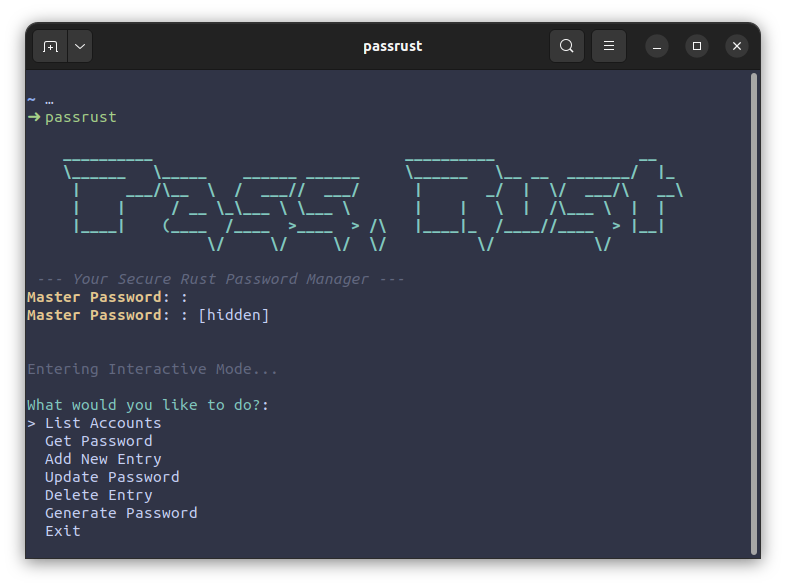

# 🛡️ PassRust: High-Security CLI Password Manager

[](https://github.com/nicoverdin/rust_pass/actions/workflows/rust.yml)
[](https://github.com/nicoverdin/rust_pass/actions/workflows/docs.yml)


## 📚 [Documentation Live Demo](https://nicoverdin.github.io/rust_pass/rust_pass/)

---



A lightweight, secure command-line password manager built with **Rust**. This project focuses on high-performance cryptography, **anti-forensic memory management**, and a user-friendly hybrid interface.

Unlike standard managers, PassRust implements **active memory scrubbing** at the OS level to prevent cold-boot attacks and RAM dumps.

## 🧠 Key Learnings & Engineering Challenges

### 🛡️ Cryptographic Integrity (AES-256-GCM)
I implemented **AES-256-GCM** (Galois/Counter Mode) instead of standard CBC. This provides **Authenticated Encryption**. It prevents "bit-flipping" attacks by using an authentication tag, ensuring that if the encrypted vault is tampered with on disk, the system detects it and refuses to decrypt.

### 🔑 GPU-Resistant Key Derivation (Argon2id)
To protect against brute-force attacks, I integrated **Argon2id** (winner of the Password Hashing Competition).
* **Tuning:** The parameters are fine-tuned to force a computation time of **~500ms** per attempt.
* **Result:** This latency is imperceptible to humans but makes dictionary attacks computationally infeasible for hackers.

### 🧹 Advanced Memory Safety (The "Ghost Buffer" Problem)
Developing this manager revealed a critical flaw in standard Rust I/O: `std::io::stdin` buffers user input in memory, leaving copies of passwords even after `Zeroize` is called.
* **Solution:** I implemented a custom input handler using **Raw File Descriptors** (`File::from_raw_fd(0)`).
* **Outcome:** This bypasses the standard library's internal cache, allowing me to read the password byte-by-byte directly from the kernel pipe into a protected buffer, ensuring **zero residue** in RAM.

---

## 🧪 Security Audit Suite (Verified)

This repository includes a suite of attack scripts (`/attacks`) to verify defenses in real-time.

| Threat | Defense Implementation | Verification Script | Status |
| :--- | :--- | :--- | :--- |
| **Bit-Flipping / Corruption** | **AES-256-GCM**. Tag validation fails on single-bit change. | `./attacks/attack_01_integrity.sh` | ✅ **SECURE** |
| **Brute Force / Dictionary** | **Argon2id**. Tuned for high memory/time cost (~500ms). | `./attacks/attack_02_bruteforce.sh` | ✅ **MITIGATED** |
| **RAM Dump / Cold Boot** | **Zeroize + Raw Stdin I/O**. No buffer traces. | `./attacks/attack_03_memory.sh` | ✅ **INVISIBLE** |

---

## 🚀 Installation

To install **PassRust** on your local machine:

```bash
git clone https://github.com/nicoverdin/rust_pass.git
cd rust_pass
chmod +x install.sh
./install.sh
```

Once installed, simply run:
```bash
passrust
```

## Usage

PassRust supports two modes of operation:

### 1. Interactive Mode (Recommended)
Simply run the program without arguments to enter the secure menu:
```bash
passrust
```

### 2. CLI Mode (Arguments)
For quick automation:
```bash
passrust add google myuser mypassword
passrust get google
passrust update google newpassword
passrust delete google
passrust list
passrust gen 24
```

---

## Technical Specifications

| Component | Implementation |
| :--- | :--- |
| **Language** | Rust 🦀 |
| **Encryption** | AES-256-GCM (Authenticated) |
| **KDF** | Argon2id (Memory-hard) |
| **Memory Protection** | `zeroize` + `std::os::fd` (Raw I/O) |
| **Persistence** | Structured JSON with Salt persistence |
| **UI** | Dialoguer + Clap |

## Security Design Choices

### Why AES-256-GCM?
Standard AES only provides confidentiality. **GCM** ensures both confidentiality and **integrity**. If the `vault.json` file is tampered with by even a single bit, the decryption will fail, preventing the injection of malicious payloads.

### Why Argon2id?
Unlike SHA-256 or PBKDF2, **Argon2id** is designed to be memory-hard. It requires a significant amount of RAM to compute, making it extremely expensive for attackers to use specialized hardware (GPUs/ASICs) to crack your master password.

### Nonce Management
Each entry is encrypted with a unique, randomly generated **96-bit Nonce**. Reusing a nonce with the same key is a critical security failure in GCM; PassRust enforces strict nonce uniqueness for every operation.

---

## 🗺️ Roadmap

- [x] **Core Cryptography (AES + Argon2)**
- [x] **Memory Scrubbing (Raw I/O)**
- [x] **Security Audit Scripts**
- [ ] **Cloud Sync Integration** (Encrypted blob storage)
- [ ] **Password Health Audit** (HaveIBeenPwned API)
- [ ] **Cross-Platform GUI** (Tauri)

---
License: MIT